# 🔍 AI-Powered Semantic Search in Laravel

Simple guide to building smart search that understands meaning, not just keywords.

---

## 📋 Prerequisites

Before diving in, you should be familiar with:

- **PHP** - Basic syntax, arrays, functions, classes
- **Laravel** - MVC pattern, Eloquent ORM, migrations, service layer
- **REST APIs** - HTTP methods, JSON requests/responses, API endpoints
- **Database** - SQL basics, migrations, JSON storage

**Don't worry if you're new to AI/ML** - This guide explains everything step by step! 🎓

---

## 🎯 The Problem

**Traditional Search:**
- Query: "I forgot my login"
- Result: ❌ No matches (needs exact keywords)

**AI-Powered Search:**
- Query: "I forgot my login"
- Result: ✅ Finds "How to Reset Your Password" (understands meaning!)

---

## 🏗️ How It Works

### The Big Picture

```mermaid
graph LR
    subgraph "📝 Article Setup"
        A[📄 Article Created] --> B[🤖 Convert to Numbers<br/>via OpenAI]
        B --> C[(💾 Database)]
    end
    
    subgraph "🔍 Search Flow"
        D[👤 User Searches] --> E[🤖 Convert Query to Numbers]
        E --> F[🔎 Find Similar Articles]
        F --> G[📋 Return Results]
    end
    
    style A fill:#e1f5ff,stroke:#1976d2,stroke-width:2px
    style B fill:#fff9c4,stroke:#f57f17,stroke-width:2px
    style C fill:#e3f2fd,stroke:#1565c0,stroke-width:3px
    style D fill:#e1f5ff,stroke:#1976d2,stroke-width:2px
    style E fill:#fff9c4,stroke:#f57f17,stroke-width:2px
    style F fill:#e8f5e9,stroke:#388e3c,stroke-width:2px
    style G fill:#fff4e6,stroke:#e65100,stroke-width:2px
```



---

## 🔑 Simple Explanation

**Embedding** = Converting text into a list of numbers that represent meaning

- Similar texts → Similar numbers
- Different texts → Different numbers

**Similarity Score** = How similar two number lists are

- **0.9+** = Very similar (great match!)
- **0.7-0.9** = Somewhat similar (good match)
- **0.5-0.7** = Not very similar (maybe relevant)
- **0.0-0.5** = Different (not relevant)

### Simple Example

```
Step 1: Article Created
"How to Reset Your Password"
         ↓
Step 2: Convert to Numbers (Embedding)
[0.12, -0.45, 0.78, ..., 0.23]  ← 1536 numbers
         ↓
Step 3: Store in Database
articles.embedding_vector = "[0.12, -0.45, ...]"

Step 4: User Searches
"I forgot my login"
         ↓
Step 5: Convert Query to Numbers
[0.15, -0.42, 0.81, ..., 0.19]
         ↓
Step 6: Compare Numbers
Find articles with similar numbers
         ↓
Step 7: Return Best Matches
"How to Reset Your Password" ✅
```

---

## 💻 The Code

### Main Search Function

**File:** [`app/Services/Embedding/ArticleEmbeddingService.php`](app/Services/Embedding/ArticleEmbeddingService.php)

```php
public function search(string $query, int $limit = 10): Collection
{
    // Step 1: Convert search query to numbers (embedding)
    $queryVector = $this->embeddingService->generate($query);
    
    // Step 2: Get all published articles that have embeddings
    $articles = Article::query()
        ->where('is_published', true)
        ->whereNotNull('embedded_at')
        ->get();
    
    // Step 3: Compare query numbers with each article's numbers
    // Calculate how similar they are (0.0 = different, 1.0 = identical)
    $results = $articles->map(fn (Article $article) => $this->calculateSimilarity($article, $queryVector))
        ->filter() // Remove articles without embeddings
        ->sortByDesc('similarity') // Best matches first (highest similarity score)
        ->take($limit) // Get top N results
        ->values();
    
    // Step 4: Return articles in order of similarity
    $articleIds = $results->map(fn ($result) => $result['article']->id)->all();
    
    if (empty($articleIds)) {
        return new Collection;
    }
    
    return Article::query()->whereIn('id', $articleIds)->get();
}
```

### API Endpoint

**File:** [`app/Http/Controllers/Api/Article/ArticlesController.php`](app/Http/Controllers/Api/Article/ArticlesController.php)

```php
public function search(SearchArticleRequest $request): ListResource
{
    $articles = $this->articleEmbeddingService->search(
        $request->validated()['query'], 
        10
    );
    
    return new ListResource($articles);
}
```

### Similarity Calculation

**File:** [`app/Utils/VectorMath.php`](app/Utils/VectorMath.php)

```php
public static function cosineSimilarity(array $vectorA, array $vectorB): float
{
    // This function compares two lists of numbers (embeddings)
    // Think of it like comparing two fingerprints - similar patterns = similar meaning
    
    // Safety check: both lists must have the same length
    if (count($vectorA) !== count($vectorB)) {
        return 0.0; // Can't compare if lengths don't match
    }
    
    // We'll calculate three things:
    // 1. How much the numbers align (dot product)
    // 2. How "big" the first list is (norm A)
    // 3. How "big" the second list is (norm B)
    $dotProduct = 0.0; // Sum of: number1 * number2 for each position
    $normA = 0.0;      // Sum of: number1 * number1 (squared values)
    $normB = 0.0;      // Sum of: number2 * number2 (squared values)
    
    // Go through each position in both lists
    foreach ($vectorA as $i => $valueA) {
        $valueB = $vectorB[$i]; // Get the number at the same position in list B
        
        // Multiply numbers at same position and add to total
        // If both are positive or both negative → adds to similarity
        // If one positive, one negative → reduces similarity
        $dotProduct += $valueA * $valueB;
        
        // Square each number and add to its "size" total
        // This helps us normalize (make the comparison fair regardless of list size)
        $normA += $valueA * $valueA;
        $normB += $valueB * $valueB;
    }
    
    // Safety check: avoid division by zero
    if ($normA === 0.0 || $normB === 0.0) {
        return 0.0; // Can't calculate similarity if one list is empty
    }
    
    // Final calculation: divide the alignment by the "size" of both lists
    // This gives us a score between -1.0 and 1.0
    // We typically get values between 0.0 (completely different) and 1.0 (identical)
    return $dotProduct / (sqrt($normA) * sqrt($normB));
}
```

---

## 📊 Database Setup

Add one column to store the numbers:

```sql
ALTER TABLE articles ADD COLUMN embedding_vector TEXT NULL;
```

That's it! Store the numbers as JSON text.

**Migration:** [`database/migrations/2025_11_07_232344_add_embedding_vector_to_articles_table.php`](database/migrations/2025_11_07_232344_add_embedding_vector_to_articles_table.php)

---

## 🎨 Real Example

### When Article is Created

```
Article: "How to Reset Your Password"
         ↓
Call OpenAI API
         ↓
Get: [0.12, -0.45, 0.78, ..., 0.23]  (1536 numbers)
         ↓
Save to: articles.embedding_vector
```

### When User Searches

```
Query: "I forgot my login"
         ↓
Call OpenAI API
         ↓
Get: [0.15, -0.42, 0.81, ..., 0.19]
         ↓
Compare with all article vectors
         ↓
Similarity Scores:
  - "Reset Password": 0.92 ✅ (very similar!)
  - "Create Account": 0.45 ❌ (not similar)
  - "Login Help": 0.78 ✅ (somewhat similar)
         ↓
Return: "Reset Password", "Login Help"
```

---

## 🎬 Try It Yourself

**Step 1:** Seed sample articles with embeddings:
```bash
php artisan db:seed --class=ArticleSeeder
```

**Step 2:** Import this curl into Postman and test:

```bash
curl --location 'http://localhost/api/articles/search' \
--header 'Content-Type: application/json' \
--data '{
    "query": "I forgot my login password",
    "limit": 10
}'
```

**Try these queries:**
- `"I forgot my login"` → Finds "How to Reset Your Password"
- `"security authentication"` → Finds "Setting Up Two-Factor Authentication"
- `"API usage limits"` → Finds "Understanding API Rate Limits"

---

## 📁 Files You Need

```
app/
├── Services/Embedding/
│   └── ArticleEmbeddingService.php   ← Main search logic
├── Utils/
│   └── VectorMath.php                ← Compare numbers
└── Http/Controllers/Api/Article/
    └── ArticlesController.php        ← API endpoint
```

**Full code:** [`app/Services/Embedding/ArticleEmbeddingService.php`](app/Services/Embedding/ArticleEmbeddingService.php)

---

## 🔗 Full Code

See complete implementation: [AIDesk Mini](https://github.com/YahorDubrouski/aidesk-mini)

**Key Files:**
- [`app/Services/Embedding/ArticleEmbeddingService.php`](app/Services/Embedding/ArticleEmbeddingService.php)
- [`app/Utils/VectorMath.php`](app/Utils/VectorMath.php)
- [`app/Http/Controllers/Api/Article/ArticlesController.php`](app/Http/Controllers/Api/Article/ArticlesController.php)

---

**Ready to use in your projects! 🚀**
