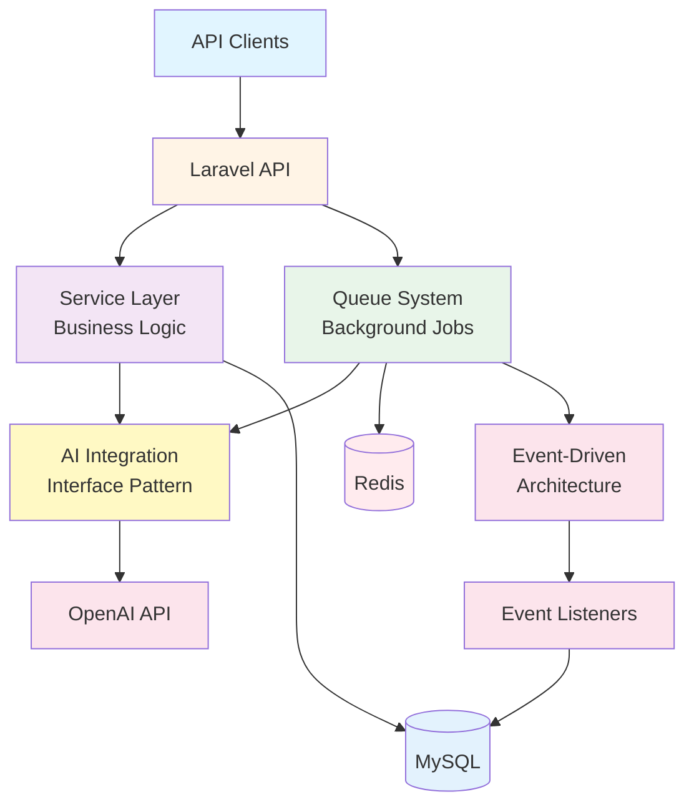
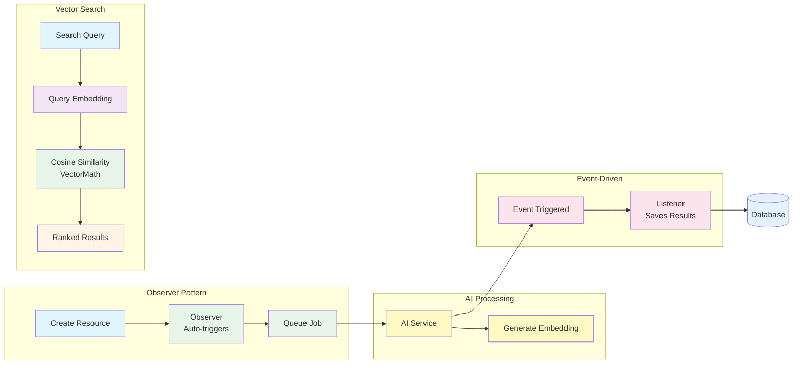
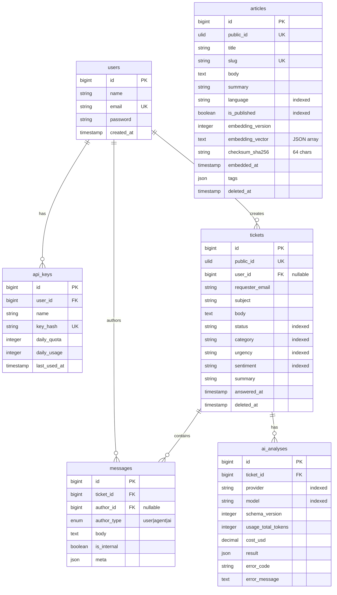
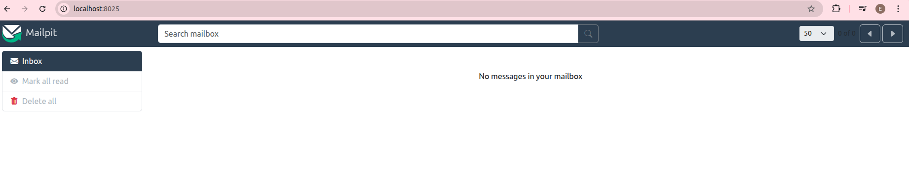
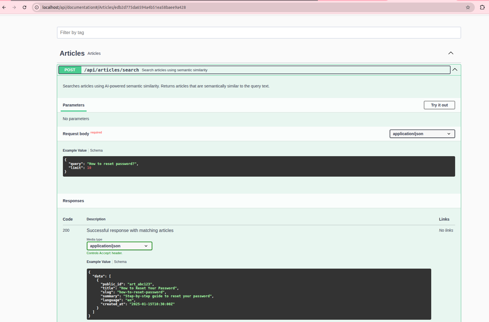
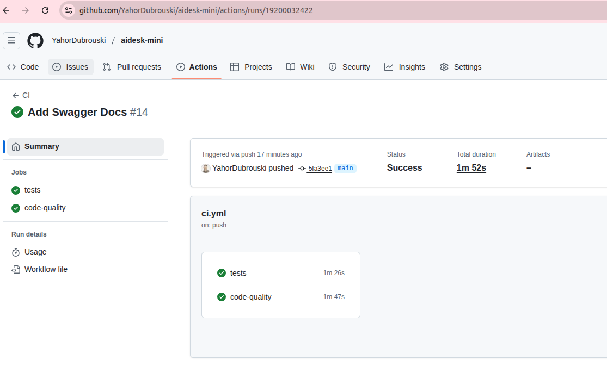

# 🚀 AIDesk Mini - AI-Powered Ticket Triage & Knowledge Base

<div align="center">


**Enterprise-grade backend API showcasing advanced Laravel architecture, AI integration, and modern DevOps practices**

[Features](#-features) • [Architecture](#-architecture) • [Tech Stack](#-tech-stack) • [API Documentation](#-api-documentation) • [Getting Started](#-getting-started)

</div>

---

## 📋 Table of Contents

- [Overview](#-overview)
- [Features](#-features)
- [Architecture](#-architecture)
- [Tech Stack](#-tech-stack)
- [Key Capabilities](#-key-capabilities)
- [API Documentation](#-api-documentation)
- [Getting Started](#-getting-started)
- [Development](#-development)
- [Testing](#-testing)
- [CI/CD](#-cicd)
- [Project Structure](#-project-structure)

---

## 🎯 Overview

**AIDesk Mini** is a production-ready, enterprise-grade backend API that demonstrates advanced software engineering practices. Built with Laravel 12, this portfolio project showcases:

- **AI-Powered Intelligence**: Automated ticket analysis, sentiment detection, and semantic search
- **Scalable Architecture**: Domain-driven design, service layer pattern, event-driven architecture
- **Enterprise Features**: API key management, rate limiting, health monitoring, feature toggles
- **DevOps Excellence**: Docker containerization, CI/CD pipelines, automated testing
- **Code Quality**: Clean code principles, comprehensive testing, automated code style checks

This project serves as a comprehensive demonstration of backend development expertise, covering everything from AI integration to infrastructure automation.

---

## ✨ Features

### 🤖 AI-Powered Capabilities

- **Intelligent Ticket Analysis**: Automatic categorization, sentiment detection, and urgency assessment
- **Content Moderation**: AI-powered content filtering and safety checks
- **Semantic Search**: Vector-based embeddings for intelligent article search using cosine similarity
- **Multi-Provider Support**: Flexible AI client architecture supporting OpenAI and test implementations
- **Retry Logic**: Intelligent retry mechanisms with exponential backoff for unstable connections

### 🔐 Authentication & Security

- **Laravel Sanctum**: Token-based authentication for web and API
- **API Key Management**: Full CRUD operations for API keys with daily quota tracking
- **Rate Limiting**: Built-in quota management and usage tracking
- **Request Correlation**: Unique correlation IDs for request tracing across services

### 📊 Queue & Background Processing

- **Laravel Horizon**: Real-time queue monitoring and management
- **Async Job Processing**: Background ticket analysis and embedding generation
- **Retry Logic**: Intelligent retry mechanisms for unstable connections
- **Event-Driven Architecture**: Decoupled event listeners for scalable processing

### 🏗️ Architecture & Design Patterns

- **Domain-Driven Structure**: Organized by feature/domain (Article, Ticket, Auth, ApiKey)
- **Service Layer Pattern**: Business logic separated from controllers
- **DTO Pattern**: Type-safe data transfer objects
- **Observer Pattern**: Automatic embedding generation on article updates
- **Feature Toggles**: Runtime feature flag management
- **Interface Pattern**: AI client abstraction for testability and flexibility

### 🐳 DevOps & Infrastructure

- **Docker Compose**: Multi-container setup with custom health checks
- **CI/CD Pipeline**: Automated testing and code quality checks via GitHub Actions
- **Health Monitoring**: Live/ready health check endpoints for orchestration
- **Custom Docker Images**: Optimized PHP 8.4 containers

### 📝 Code Quality

- **Comprehensive Testing**: 16 passing tests with 70+ assertions
- **Test Doubles**: Fake AI client for reliable testing without external dependencies
- **Code Style**: Automated formatting with Laravel Pint
- **Type Safety**: Strict types throughout the codebase
- **Clean Code**: SOLID principles, meaningful naming, DRY patterns
- **API Documentation**: Auto-generated Swagger/OpenAPI specs
- **Data Integrity**: Checksum validation prevents unnecessary embedding regeneration
- **Soft Deletes**: Data retention with soft delete pattern

---

## 🏛️ Architecture

### High-Level Architecture



**Key Architectural Patterns:**
- **Service Layer**: Business logic separated from controllers
- **Queue Processing**: Async job processing with Horizon
- **AI Integration**: Interface-based design for flexibility
- **Event-Driven**: Decoupled event/listener architecture

### Data Flow Diagram

The following diagram illustrates key architectural patterns through data flow:



**Key Patterns Showcased:**

1. **Observer Pattern**: Automatic job dispatch on model events (ticket/article creation)
2. **Queue Processing**: Background AI processing via Horizon
3. **Event-Driven Architecture**: Decoupled event/listener pattern for result storage
4. **Vector Search**: Semantic search using embeddings and cosine similarity

### Database Schema

The following diagram shows the core database structure with key relationships:



**Key Database Features:**

- **Foreign Key Relationships**: Proper referential integrity with cascade deletes
- **Indexes**: Strategic indexes on frequently queried fields (status, category, urgency, sentiment)
- **Vector Storage**: `embedding_vector` field stores JSON-encoded embeddings for semantic search
- **Soft Deletes**: Tickets and articles use soft deletes for data retention
- **Composite Indexes**: Optimized for common query patterns (status + created_at, ticket_id + created_at)

### Domain Structure

The application follows a **domain-driven folder structure**:

```
app/
├── Http/
│   ├── Controllers/Api/
│   │   ├── Article/ArticlesController.php
│   │   ├── Ticket/TicketsController.php
│   │   ├── Auth/AuthController.php
│   │   └── ApiKey/ApiKeysController.php
│   ├── Requests/Api/
│   │   ├── Article/SearchArticleRequest.php
│   │   ├── Ticket/StoreTicketRequest.php
│   │   └── ...
│   └── Resources/Api/
│       ├── Article/ListResource.php
│       └── ...
├── Services/
│   ├── Ai/
│   ├── Embedding/
│   ├── Ticket/
│   └── Auth/
├── Jobs/
│   ├── Article/GenerateArticleEmbeddingJob.php
│   └── Ticket/AnalyzeTicketJob.php
└── Events/
    └── Ticket/
```

---

## 🛠️ Tech Stack

### Core Framework
- **Laravel 12.x** - Latest Laravel framework
- **PHP 8.4** - Modern PHP
- **MySQL 8.0** - Primary database
- **Redis** - Caching and queue backend

### AI & Machine Learning
- **OpenAI API** - GPT models for analysis and embeddings
- **Vector Math** - Custom cosine similarity implementation
- **Embedding Generation** - Automatic article embeddings

### Queue & Background Jobs
- **Laravel Horizon** - Queue monitoring dashboard
- **Redis Queue** - Reliable job processing

### Development Tools
- **Laravel Sail** - Docker development environment
- **Laravel Pint** - Code style enforcement
- **PHPUnit** - Testing framework

### DevOps & Infrastructure
- **Docker & Docker Compose** - Containerization
- **GitHub Actions** - CI/CD automation
- **Swagger/OpenAPI** - API documentation

### Additional Services
- **Mailpit** - Email testing
- **Health Checks** - Custom container health monitoring



*Email testing and debugging with Mailpit*

---

## 🎯 Key Capabilities

### 1. **AI-Powered Ticket Analysis**
```php
// Automatic analysis on ticket creation
Ticket::create(['subject' => 'Urgent issue', 'body' => '...']);
// → Triggers AnalyzeTicketJob
// → AI determines: urgency, sentiment, category
// → Results stored via event listeners
```

### 2. **Semantic Article Search**
```php
// Vector-based similarity search
POST /api/articles/search
{
  "query": "password reset",
  "limit": 10
}
// → Generates query embedding
// → Calculates cosine similarity
// → Returns most relevant articles
```

### 3. **API Key Management**
```php
// Full lifecycle management
POST /api/api-keys → Generate new key
GET /api/api-keys → List user's keys
DELETE /api/api-keys/{id} → Revoke key
// → Daily quota tracking
// → Usage monitoring
```

### 4. **Feature Toggles**
```php
// Runtime feature control
config('features.ticket_ai_analysis') // Enable/disable AI
config('features.article_ai_embeddings') // Toggle embeddings
```

### 5. **Event-Driven Processing**
```php
// Automatic embedding generation
Article::create(['title' => '...', 'is_published' => true]);
// → ArticleObserver triggers
// → GenerateArticleEmbeddingJob dispatched
// → Embedding stored with checksum validation
```

### 6. **Request Correlation & Logging**
```php
// Automatic correlation ID generation
X-Correlation-ID: uuid-here
// → Added to all log entries
// → Returned in response headers
// → Enables request tracing across services
```

---

## 📚 API Documentation

### Interactive API Docs

Swagger/OpenAPI documentation is automatically generated and available at:

```
http://localhost/api/documentation
```



### Key Endpoints

#### Authentication
- `POST /api/auth/register` - User registration
- `POST /api/auth/login` - User login
- `POST /api/auth/logout` - User logout (authenticated)

#### API Keys
- `GET /api/api-keys` - List user's API keys
- `POST /api/api-keys` - Create new API key
- `DELETE /api/api-keys/{id}` - Revoke API key

#### Tickets
- `POST /api/tickets` - Create new ticket (triggers AI analysis)
- `GET /api/tickets/{id}` - Get ticket details

#### Articles
- `POST /api/articles/search` - Semantic search with embeddings

#### Health
- `GET /api/health/live` - Liveness probe
- `GET /api/health/ready` - Readiness probe

---

## 🚀 Getting Started

### Prerequisites

- Docker & Docker Compose
- Git

### Installation

1. **Clone the repository**
```bash
git clone https://github.com/yourusername/aidesk-mini.git
cd aidesk-mini
```

2. **Copy environment file**
```bash
cp .env.example .env
```

3. **Configure environment variables**
```bash
# Edit .env file with your settings
# Required: OPENAI_API_KEY (or set OPENAI_FAKE=true for testing)
```

4. **Start Docker containers**
```bash
docker compose up -d
```

5. **Install dependencies**
```bash
docker compose exec laravel.test composer install
```

6. **Generate application key**
```bash
docker compose exec laravel.test php artisan key:generate
```

7. **Run migrations**
```bash
docker compose exec laravel.test php artisan migrate
```

8. **Generate Swagger documentation**
```bash
docker compose exec laravel.test php artisan l5-swagger:generate
```

### Access Points

- **API**: http://localhost/api
- **Swagger Docs**: http://localhost/api/documentation
- **Horizon Dashboard**: http://localhost/horizon (requires authentication)
- **Health Check**: http://localhost/api/health/ready

---

## 💻 Development

### Running Tests

```bash
# Run all tests
docker compose exec laravel.test php artisan test

# Run specific test suite
docker compose exec laravel.test php artisan test --testsuite=Feature

# With coverage
docker compose exec laravel.test php artisan test --coverage
```

### Code Style

```bash
# Check code style
docker compose exec laravel.test vendor/bin/pint --test

# Fix code style
docker compose exec laravel.test vendor/bin/pint
```

### Queue Processing

```bash
# Process queue jobs
docker compose exec laravel.test php artisan queue:work

# Or use Horizon (recommended)
# Access dashboard at http://localhost/horizon
```

### Database

```bash
# Run migrations
docker compose exec laravel.test php artisan migrate

# Seed database
docker compose exec laravel.test php artisan db:seed

# Create migration
docker compose exec laravel.test php artisan make:migration create_example_table
```

---

## 🧪 Testing

### Test Coverage

- **16 tests** passing
- **70+ assertions**
- **Feature tests**: Authentication, API keys, article search
- **Unit tests**: Service layer, utilities

### Test Structure

```
tests/
├── Feature/
│   ├── ApiKeyTest.php
│   ├── ArticleSearchTest.php
│   ├── AuthTest.php
│   └── ExampleTest.php
└── Unit/
    └── ExampleTest.php
```

### Running Tests

```bash
# All tests
php artisan test
```

---

## 🔄 CI/CD

### GitHub Actions Workflow

The project includes a comprehensive CI/CD pipeline:

1. **Test Job**
   - Builds Docker image
   - Runs PHPUnit tests
   - Validates database migrations

2. **Code Quality Job**
   - Runs Laravel Pint
   - Enforces code style standards

### Workflow Features

- ✅ Docker-based testing (matches production)
- ✅ Automated code quality checks
- ✅ Parallel job execution
- ✅ Caching for faster builds



*Automated testing and code quality checks via GitHub Actions*

---

## 📁 Project Structure

```
aidesk-mini/
├── app/
│   ├── Http/
│   │   ├── Controllers/Api/     # Domain-organized controllers
│   │   ├── Requests/Api/        # Form request validation
│   │   └── Resources/Api/       # API response resources
│   ├── Services/                 # Business logic layer
│   │   ├── Ai/                   # AI client implementations
│   │   ├── Embedding/            # Embedding services
│   │   └── Ticket/               # Ticket analysis services
│   ├── Jobs/                     # Queue jobs
│   ├── Events/                   # Domain events
│   ├── Listeners/                # Event listeners
│   ├── Observers/                # Model observers
│   ├── Models/                   # Eloquent models
│   ├── DTOs/                     # Data transfer objects
│   └── Utils/                    # Utility classes
├── config/
│   └── features.php              # Feature toggles
├── database/
│   ├── migrations/               # Database migrations
│   └── seeders/                  # Database seeders
├── docker/
│   └── 8.4/                      # Docker configuration
├── routes/
│   └── api.php                   # API routes
├── tests/
│   ├── Feature/                  # Feature tests
│   └── Unit/                     # Unit tests
└── .github/
    └── workflows/
        └── ci.yml                 # CI/CD pipeline
```

---

## 🎓 Skills Demonstrated

This project showcases expertise in:

- ✅ **Backend Architecture**: Domain-driven design, service layer, clean architecture
- ✅ **Laravel Framework**: Advanced features, best practices, latest version
- ✅ **AI Integration**: OpenAI API, embeddings, vector similarity
- ✅ **API Design**: RESTful APIs, authentication, rate limiting
- ✅ **Testing**: Unit tests, feature tests, test-driven development
- ✅ **DevOps**: Docker, CI/CD, containerization, health checks
- ✅ **Code Quality**: Clean code, SOLID principles, automated checks
- ✅ **Database Design**: Migrations, relationships, optimization
- ✅ **Queue Management**: Background jobs, Horizon, async processing
- ✅ **Security**: Authentication, API keys, input validation
- ✅ **Documentation**: OpenAPI/Swagger, inline documentation

---

## 📄 License

This project is open-sourced software licensed under the [MIT license](https://opensource.org/licenses/MIT).

---

## 👤 Author

**Yahor Dubrouski**

- GitHub: [@YahorDubrouski](https://github.com/YahorDubrouski)
- LinkedIn: [YahorDubrouski](https://www.linkedin.com/in/yahor-dubrouski/)

---
