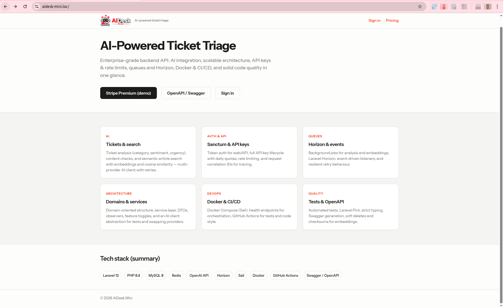
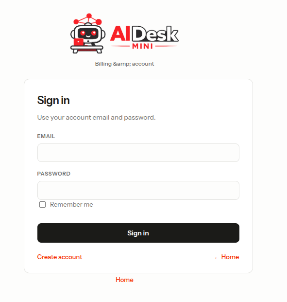
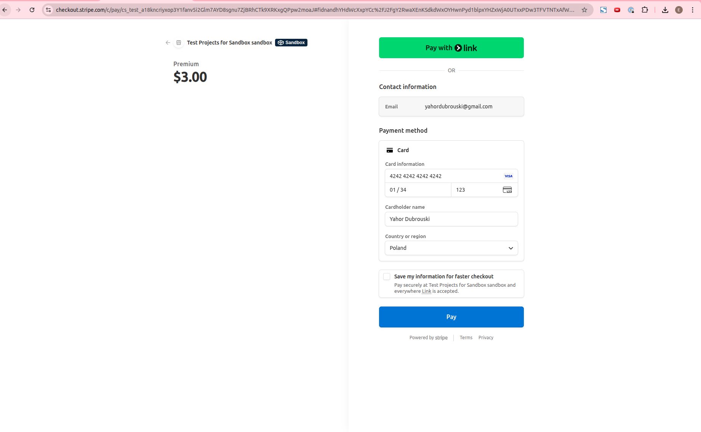
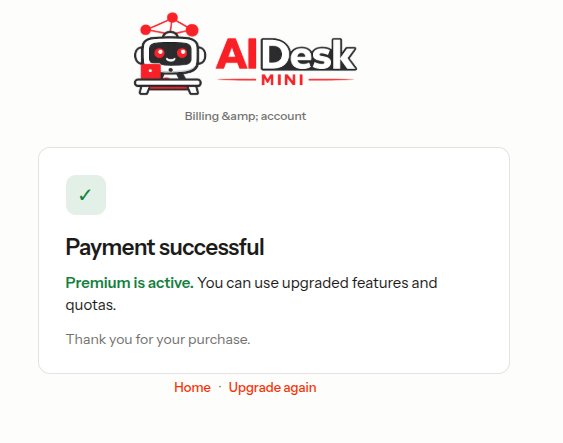
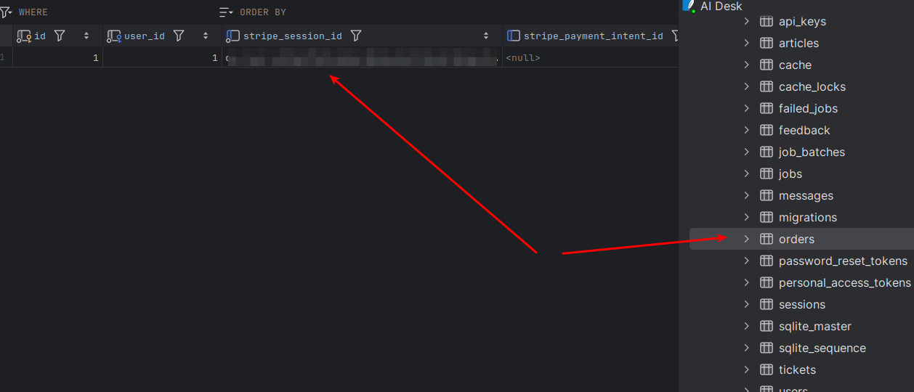
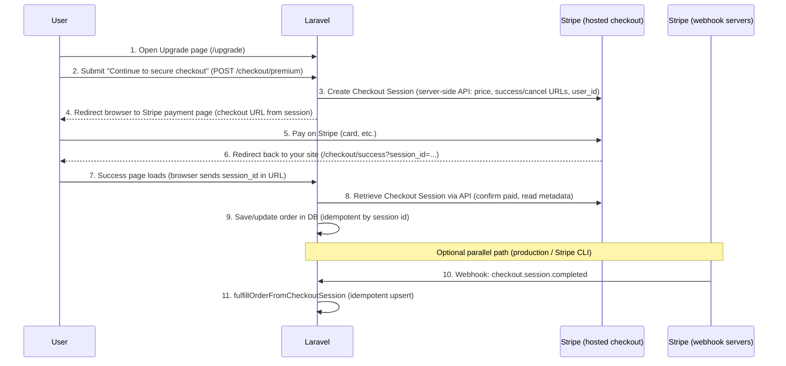

# Stripe Checkout (Premium) — feature documentation

This document explains **how Stripe is integrated** in **AIDesk Mini** for a one-time **Premium** purchase, and shows the **end-user flow** with screenshots.

---

## Table of contents

- [What the user does (screenshots)](#what-the-user-does-screenshots)
- [Architecture at a glance](#architecture-at-a-glance)
- [Configuration](#configuration)
- [Implementation map](#implementation-map)
- [Key service: `PremiumStripeCheckoutService`](#key-service-premiumstripecheckoutservice)
- [Routes](#routes)
- [Webhook & local testing](#webhook--local-testing)
- [Test card](#test-card)

---

## What the user does (screenshots)

### Step 1 — Landing: start the Premium flow

User opens the app and chooses **Stripe Premium (demo)** (or **Pricing** / **Get Premium** depending on the page).

---

### Step 2 — Sign in (session auth)

Checkout requires an authenticated user for the **web** flow. User signs in with email/password (Laravel session).

---

### Step 3 — Upgrade page: “Continue to secure checkout”

The **`/upgrade`** page explains Premium and, when signed in, submits a form to **`POST /checkout/premium`**, which creates a **Stripe Checkout Session** and redirects the browser to Stripe.

---

### Step 4 — Stripe-hosted Checkout

User completes payment on **Stripe’s** hosted page (`checkout.stripe.com`). Product and price come from your **Stripe Dashboard** (Price ID referenced in `.env`).

---

### Step 5 — Success page

After payment, Stripe redirects to **`/checkout/success?session_id=...`**. The app loads the session from Stripe, fulfills the order, and shows **Payment successful** when the order is paid.

---

### Step 6 — Backend proof: `orders` table

The integration persists a row in **`orders`** with **`stripe_session_id`** (and **`stripe_payment_intent_id`** when available from the session). This demonstrates **traceability** from app DB ↔ Stripe.

> **Note:** If `stripe_payment_intent_id` is still `null` in a screenshot, timing or session expansion can differ; the important part is **`stripe_session_id`** linking to Stripe and **`status`** reflecting fulfillment.

---

## Architecture at a glance

*Technical mapping:* step 2 = `CheckoutController::redirectToPremiumCheckout`; steps 3–4 = `PremiumStripeCheckoutService::createCheckoutSession` + `redirect()->away()`; steps 7–9 = `CheckoutController::showCheckoutSuccess` → `fulfillOrderFromCheckoutSession`; steps 10–11 = `StripeWebhookController` → `fulfillOrderFromCheckoutSession`.

---

## Configuration

| Env variable | Purpose |
|--------------|---------|
| `STRIPE_KEY` | Publishable key (frontend / Stripe.js if used) |
| `STRIPE_SECRET` | Secret key — used server-side for Checkout Session API |
| `STRIPE_PREMIUM_PRICE_ID` | **Price** ID (`price_...`), not Product ID (`prod_...`) |
| `STRIPE_WEBHOOK_SECRET` | Signing secret for `POST /api/stripe/webhook` |

Config file: `config/stripe.php` (reads the above from `env()`).

---

## Implementation map

| Concern | Location |
|---------|----------|
| Create Checkout Session | `App\Services\Payment\PremiumStripeCheckoutService::createCheckoutSession()` |
| Fulfill / persist order | `PremiumStripeCheckoutService::fulfillOrderFromCheckoutSession()` |
| Web session → Stripe redirect | `App\Http\Controllers\Api\Checkout\CheckoutController::redirectToPremiumCheckout()` — `POST /checkout/premium` (web, `auth` middleware) |
| Success / cancel pages | `CheckoutController::showCheckoutSuccess()`, `showCheckoutCancel()` + views `resources/views/checkout/*.blade.php` |
| Stripe webhook | `App\Http\Controllers\Api\Stripe\StripeWebhookController` — `POST /api/stripe/webhook` |
| Order model | `App\Models\Order` — `stripe_session_id`, `stripe_payment_intent_id`, `status`, `amount` |

Business logic stays in the **service** (`PremiumStripeCheckoutService`), controllers stay thin.

---

## Routes

**Web (session cookie auth)**

| Method | Path | Description |
|--------|------|-------------|
| GET | `/upgrade` | Upgrade marketing / CTA view |
| POST | `/checkout/premium` | Create session + redirect to Stripe |
| GET | `/checkout/success` | Success + fulfillment via `session_id` query |
| GET | `/checkout/cancel` | User cancelled on Stripe |

**API (Bearer Sanctum)**

| Method | Path | Description |
|--------|------|-------------|
| POST | `/api/checkout/premium` | JSON `{ checkout_url }` |

**Webhook (no Bearer — Stripe signature)**

| Method | Path | Description |
|--------|------|-------------|
| POST | `/api/stripe/webhook` | Verifies `Stripe-Signature`, handles `checkout.session.completed` |

---

## Test card

| Field | Value |
|-------|--------|
| Number | `4242 4242 4242 4242` |
| Expiry | Any **future** date |
| CVC | Any 3 digits |

Use only with **test** API keys (`pk_test_...` / `sk_test_...`).
