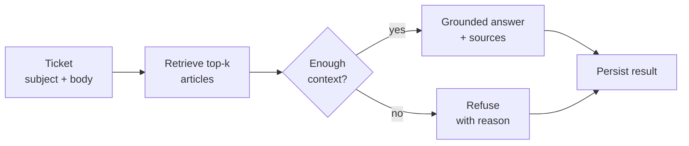
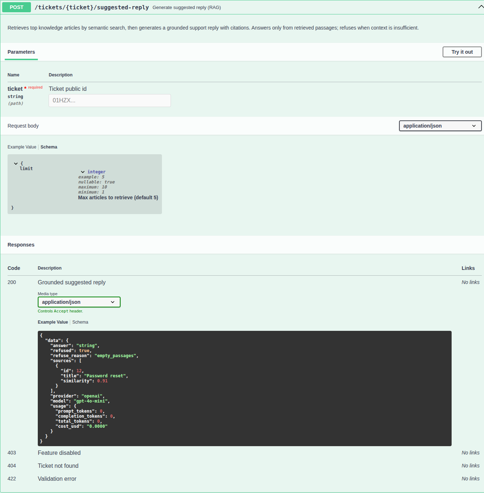
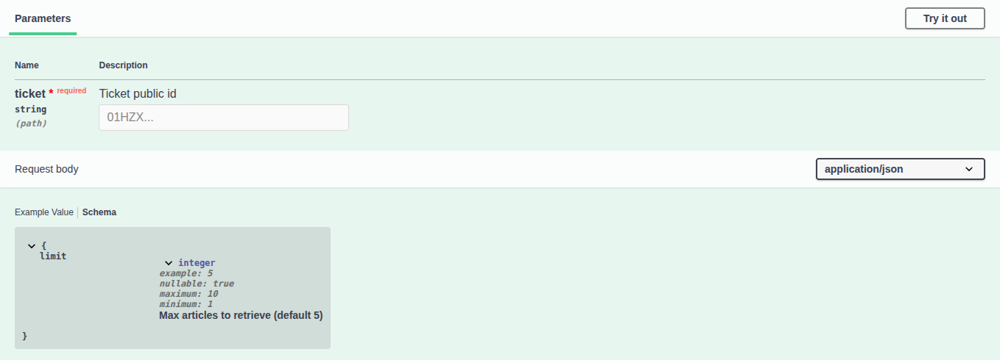
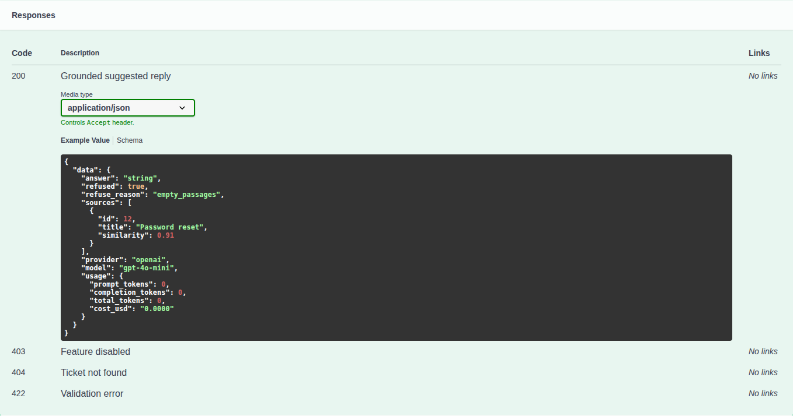

# Suggested Reply (RAG) — feature documentation

**Suggested Reply** turns a support ticket into a **grounded** agent draft. The system retrieves the most similar knowledge articles, then generates an answer **only** from those passages and returns citations — or refuses clearly when the knowledge base cannot support a reply.

**Example:** a ticket asking how to reset a password gets a short support answer that cites the password-reset article (and similar hits), not a free-form guess.



This document covers configuration, the API contract, and where the code lives for `POST /api/tickets/{ticket}/suggested-reply`.

---

## Configuration

| Env / config | Purpose |
|---|---|
| `FEATURE_TICKET_AI_SUGGESTED_REPLY` → `features.ticket_ai_suggested_reply` | Master switch for the endpoint / service |
| `FEATURE_ARTICLE_AI_EMBEDDINGS` → `features.article_ai_embeddings` | Required for retrieval |
| `OPENAI_FAKE` → `openai.fake` | Fake embeddings + grounded reply (local/CI); no API key |

When the suggested-reply flag is off, the API responds with **403**.

---

## API

```http
POST /api/tickets/{ticket}/suggested-reply
Content-Type: application/json

{ "limit": 5 }
```

- `{ticket}` is the ticket **public_id** (same binding as `GET /api/tickets/{ticket}`).
- `limit` is optional (1–10); default is 5.

**Success (grounded):** `answer`, `refused: false`, `sources[]` (`id`, `title`, `similarity`), plus `provider` / `model` / `usage`.

**Refuse:** `refused: true`, `refuse_reason` (`empty_passages` | `insufficient_context` | `invalid_model_response`), empty `sources`, default refuse answer text.

Interactive OpenAPI: `http://localhost/api/documentation` (or your local `APP_URL`).

### Swagger — operation definition

Full OpenAPI entry for the endpoint (summary, path, request, responses):



### Swagger — input (path + body)

Path parameter `ticket` (public id) and optional JSON body `limit`:



### Swagger — output (responses)

`200` grounded payload example, plus `403` / `404` / `422`:



---

## Flow (implementation)

Orchestration lives in `TicketSuggestedReplyService`: build question text → `ArticleEmbeddingService::searchWithScores` → `SuggestedReplyGeneratorInterface` (`OpenAiSuggestedReplyGenerator` or `FakeSuggestedReplyGenerator` when `OPENAI_FAKE=true`) → persist on `ticket_suggested_replies`.

---

## Related: semantic search

`POST /api/articles/search` uses the same embeddings but **only returns similar articles** (links/ids). Suggested reply goes one step further: grounded `answer` + `sources[]`, or an explicit refuse. Use search when you need a knowledge hit list; use suggested reply when you need a draft reply with citations.

---

## Eval smoke

Fixture-driven checks (Fake AI only) live in:

- `tests/Fixtures/SuggestedReply/rag_eval_cases.php`
- `tests/Unit/Ticket/SuggestedReply/SuggestedReplyRagEvalTest.php`

```bash
docker compose exec laravel.test php artisan test tests/Unit/Ticket/SuggestedReply/SuggestedReplyRagEvalTest.php
```

---

## Implementation map

| Piece | Path |
|---|---|
| Service | `app/Services/Ticket/TicketSuggestedReplyService.php` |
| Generators | `app/Services/Ticket/SuggestedReply/` |
| DTOs | `app/DTOs/Ticket/SuggestedReply/` |
| Controller | `app/Http/Controllers/Api/Ticket/SuggestedRepliesController.php` |
| Persist | `ticket_suggested_replies` / `TicketSuggestedReply` |
